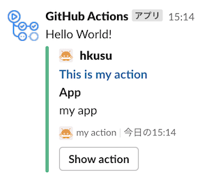

# slack post action

This is the action to post to slack.

## Inputs

See Usage.

## Outputs

See Usage.

## Usage

```yaml
- name: Post to Slack
  id: slack
  uses: hkusu/slack-post-action@v0.1.3
  env:
    SLACK_APP_TOKEN: ${{ secrets.SLACK_APP_TOKEN }} # your slack app token
  with:
    channel: 'greeting-channel'
    text: 'Hello World!' # option
    username: 'GitHub Actions' # option (default: GitHub Actions)
    icon_url: 'https://github.com/actions.png?size=48' # option (default: https://github.com/actions.png?size=48)
    color: 'good' # option (good or warning or danger or hex color code like `#ffaabb`)
    author_name: 'hkusu' # option
    author_link: 'https://github.com/hkusu' # option
    author_icon: 'https://github.com/hkusu.png' # option
    title: 'This is title' # option
    title_link: 'https://github.com/hkusu/slack-post-action' # option
    body: 'This is body' # option
    footer: 'my action' # option (default: repository name)
    footer_icon: 'https://github.com/hkusu.png' # option
    fields: '[{ "title": "Action1", "value": "my action1", "short": true }, { "title": "Action2", "value": "my action2", "short": true }]' # option
    actions: '[{ "type": "button", "text": "Show action", "url": "https://github.com/hkusu/slack-post-action" }]' # option
- name: Show result
  run: echo '${{ steps.slack.outputs.result }}'
```



## License

MIT
